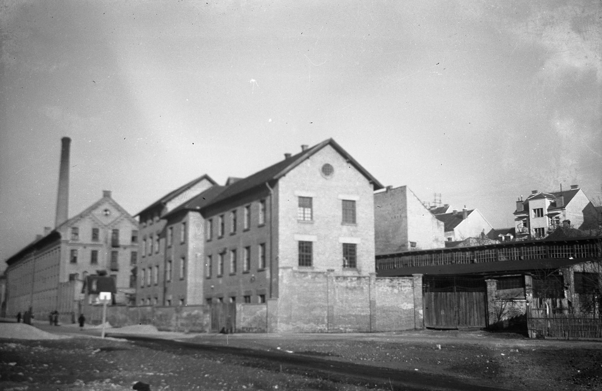

# { title }

Izložba povodom 110. godišnjice rođenja dr. Antuna Bauera osnivača muzeja Gipsoteke, prezentira njegov vizionarski poduhvat te rad i djelatnost ovog jedinstvenog muzeja u Hrvatskoj.
Bauerove pionirske ideje i muzeološki rad prikazuju se na primjeru muzeja koji je osnovao i u njega pretočio svoja iskustva i zamisli. Virtualna izložba prvotno je zamišljena u realnom prostoru muzeja ali zbog posljedica potresa 2020. godine i aktualne obnove to nije bilo moguće realizirati.

Kroz fotografski materijal, arhivske zapise te citate njegovih muzeološki razrađenih misli o svrsi, poslanju i stalnom postavu muzeja rekonstruiraju se pojedini prostori današnje Gliptoteke i Arhiva za likovne umjetnosti HAZU. Prvi postavi Gipsoteke prezentiraju rad ustanove i Bauerov muzeološki koncept uz uvijek kritički odnos prema vlastitom radu i promišljanju. Po prvi puta objavljuju se njegovi rukopisi i fotografski materijal te negativi o djelatnosti Gipsoteke i Arhiva. Time se apostrofira značaj i vrijednost zbirki današnje Gliptoteke HAZU a uz popratni vizualni materijal i citate iz tekstova i arhiva te fotografijama ističe se njegov doprinos u promišljanju i razvijanju muzeološke misli i teorije u Hrvatskoj s odjecima i u suvremenoj muzeologiji. Antun Bauer kao pionir muzeološke misli u Hrvatskoj, svojom vizijom Gipsoteke nastavlja zamisao osnivanja muzeja odljeva koju započinje još Izidor Kršnjavi s antičkim odljevima krajem 19. stoljeća (Gipsmuseum), stoga je ova izložba uz koju se održava i znanstveno stručni skup* mali doprinos valorizaciji njegova rada i vizije.
Izložba povodom 110. godišnjice rođenja dr. Antuna Bauera osnivača muzeja Gipsoteke, prezentira njegov vizionarski poduhvat te rad i djelatnost ovog jedinstvenog muzeja u Hrvatskoj.
Bauerove pionirske ideje i muzeološki rad prikazuju se na primjeru muzeja koji je osnovao i u njega pretočio svoja iskustva i zamisli. Virtualna izložba prvotno je zamišljena u realnom prostoru muzeja ali zbog posljedica potresa 2020. godine i aktualne obnove to nije bilo moguće realizirati.

Kroz fotografski materijal, arhivske zapise te citate njegovih muzeološki razrađenih misli o svrsi, poslanju i stalnom postavu muzeja rekonstruiraju se pojedini prostori današnje Gliptoteke i Arhiva za likovne umjetnosti HAZU. Prvi postavi Gipsoteke prezentiraju rad ustanove i Bauerov muzeološki koncept uz uvijek kritički odnos prema vlastitom radu i promišljanju. Po prvi puta objavljuju se njegovi rukopisi i fotografski materijal te negativi o djelatnosti Gipsoteke i Arhiva. Time se apostrofira značaj i vrijednost zbirki današnje Gliptoteke HAZU a uz popratni vizualni materijal i citate iz tekstova i arhiva te fotografijama ističe se njegov doprinos u promišljanju i razvijanju muzeološke misli i teorije u Hrvatskoj s odjecima i u suvremenoj muzeologiji. Antun Bauer kao pionir muzeološke misli u Hrvatskoj, svojom vizijom Gipsoteke nastavlja zamisao osnivanja muzeja odljeva koju započinje još Izidor Kršnjavi s antičkim odljevima krajem 19. stoljeća (Gipsmuseum), stoga je ova izložba uz koju se održava i znanstveno [stručni skup][1] mali doprinos valorizaciji njegova rada i vizije.

[1]: <#strucni-skup-link> "Stručni skup"