# {title}

> Gipsoteka naprotiv ima svrhu da sistematski složenom **zbirkom odljeva** najznačajnijih umjetničkih i historijskih spomenika dade iscrpnu **sliku razvoja umjetnosti** naše sredine.

> Jedino **odljevanjem** izabranih značajnih spomenika može se prikupiti muzejska zbirka koja bi bila u stanju da dade zaokruženu sliku umjetničkog stvaranja našeg naroda.

U sklopu muzeja osnovana je i **vlastita radionica** sa stručnjacima za izradu sadrenih odljeva i kalupa. U njoj je odliven velik dio eksponata za Zbirku hrvatskih povijesnih spomenika.
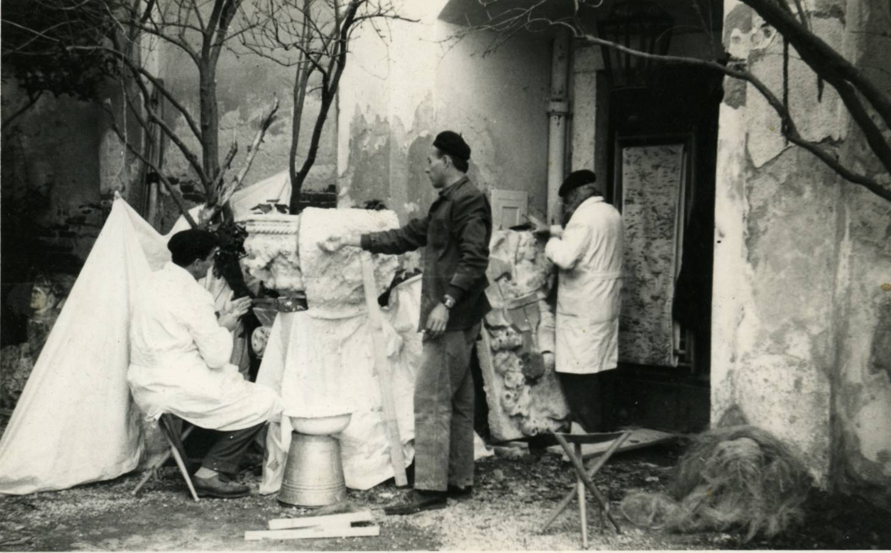
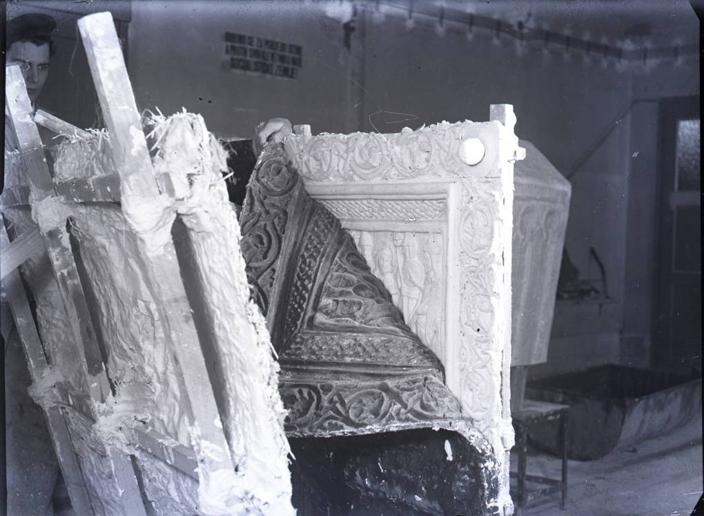

_Osnovni cilj Gipsoteke je da sakupi što potpunije zbirku gipsanih odljeva i modela radova naših majstora od najstarijih vremena do danas._
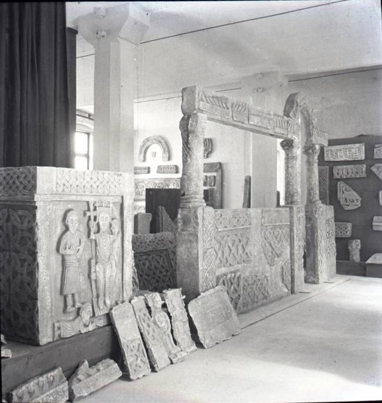
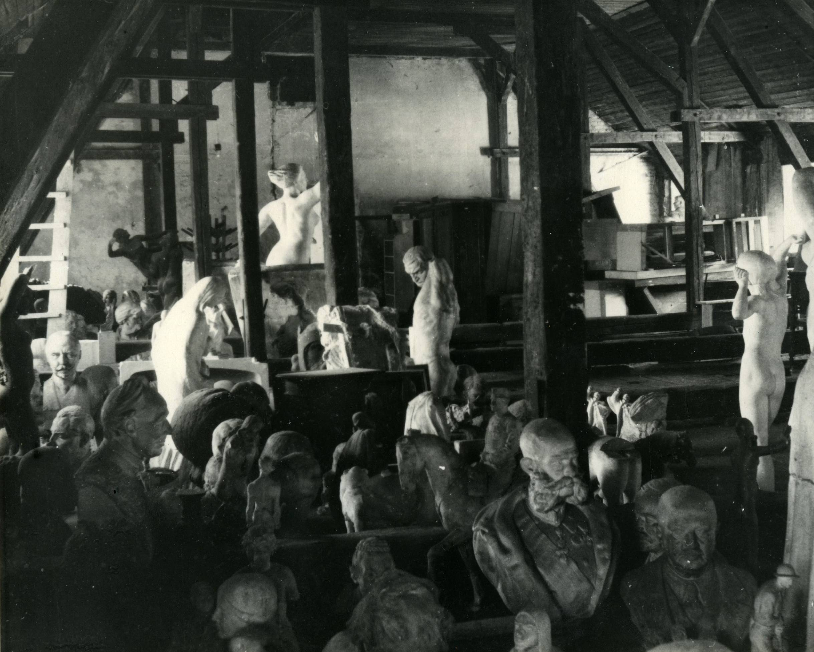
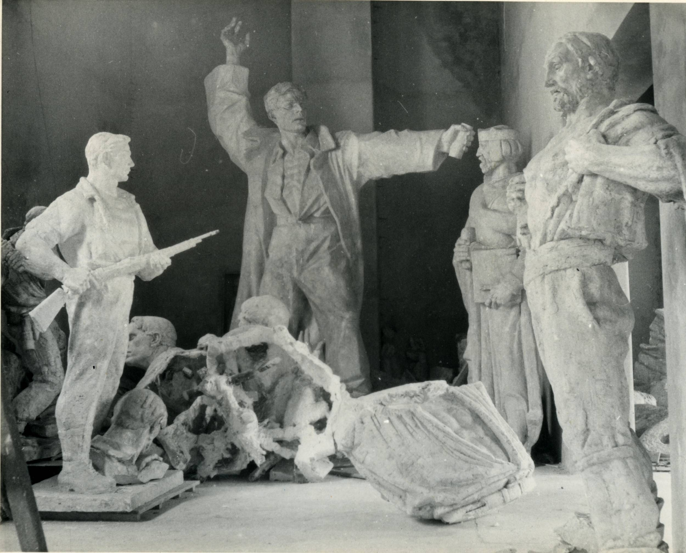

Sistematičnim prikupljanjem pomoćnog materijala koji je bio vezan uz zbirke Gipsoteke i potreban za stručni studij, prikupljen je materijal o radu suvremenih domaćih slikara, koji je neposredno vezan s kiparstvom. Na taj način kao rezultat rada vezan uz zbirke Gipsoteke stvoren je ovdje "arhiv za domaću umjetnost".
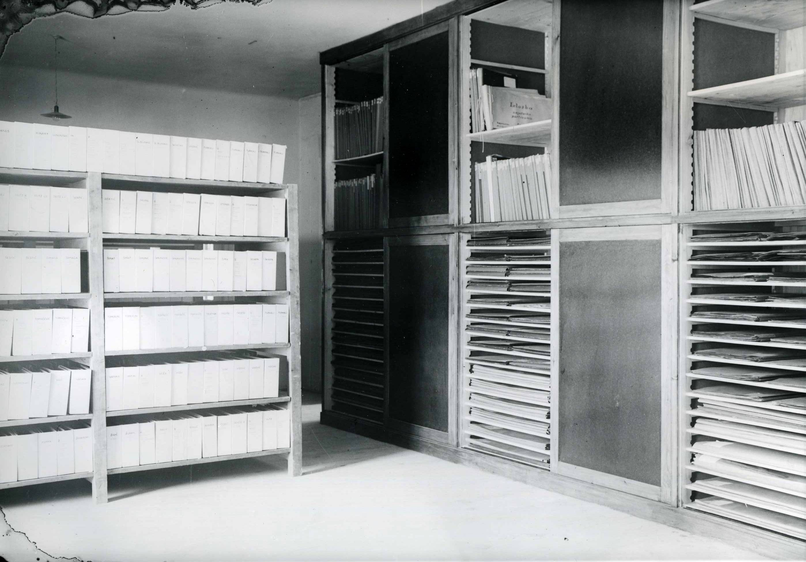

Postav ovog muzeja je kulturna potreba. Potrebno je da se naše manifestacije na umjetničkom polju približe široj javnosti….Ovakvim zbirkama možemo u širokom opsegu pokazati i dokazati blago naše kulture i tradicije na umjetničkom polju.

Monumentalna plastika traži za svoje djelovanje i monumentalan prostor...
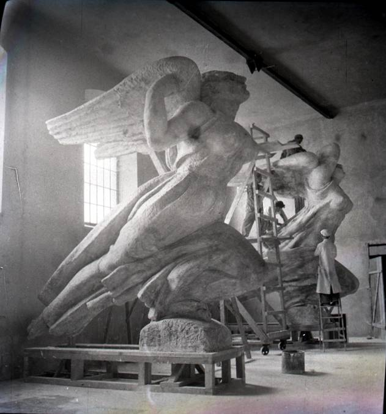

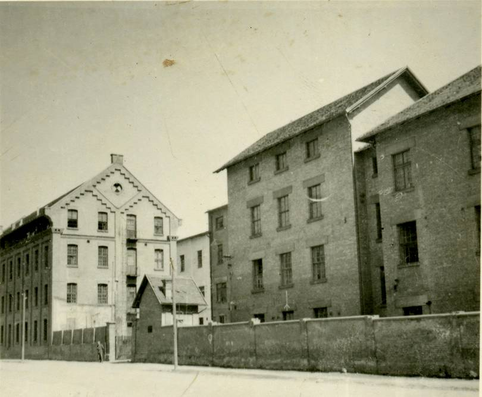
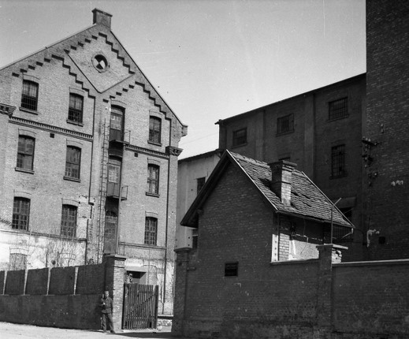
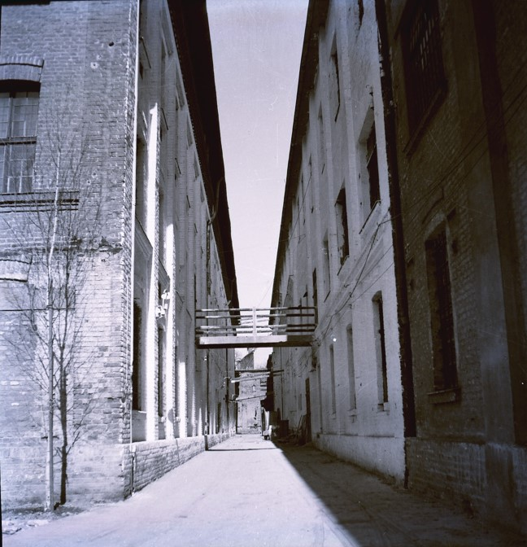
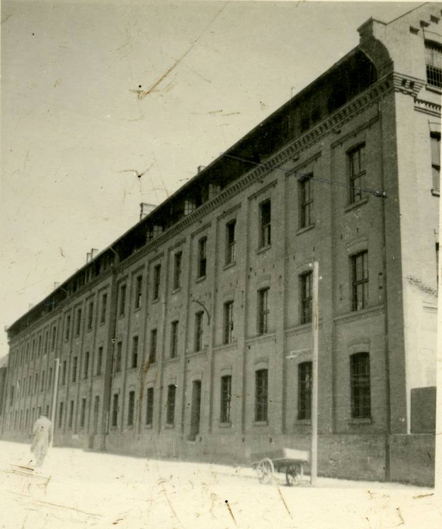
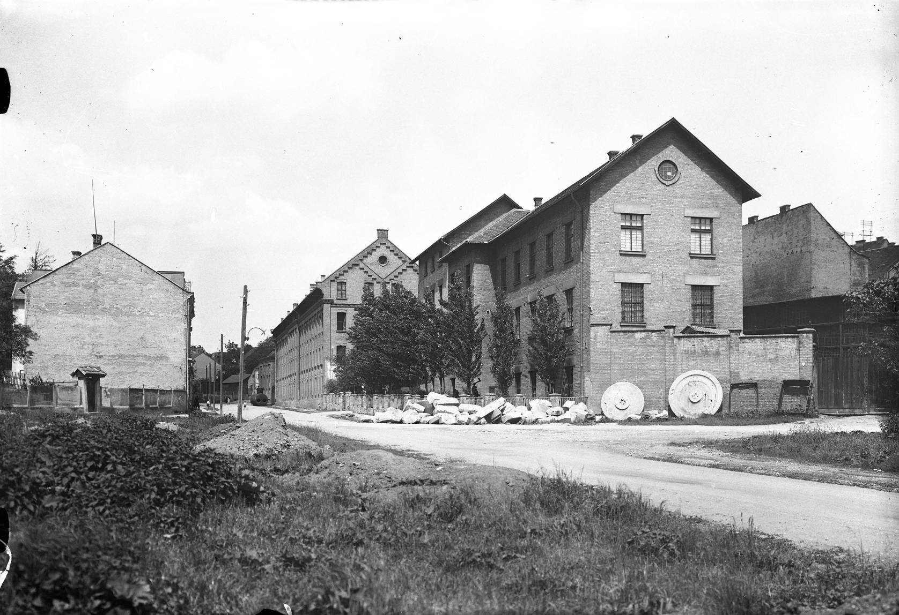

