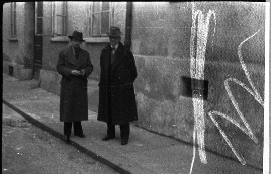
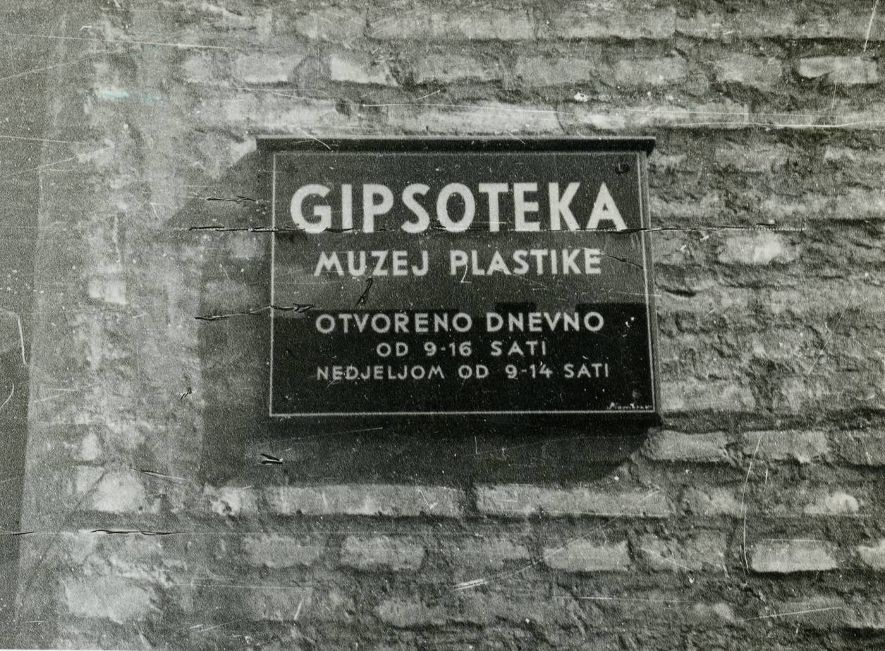
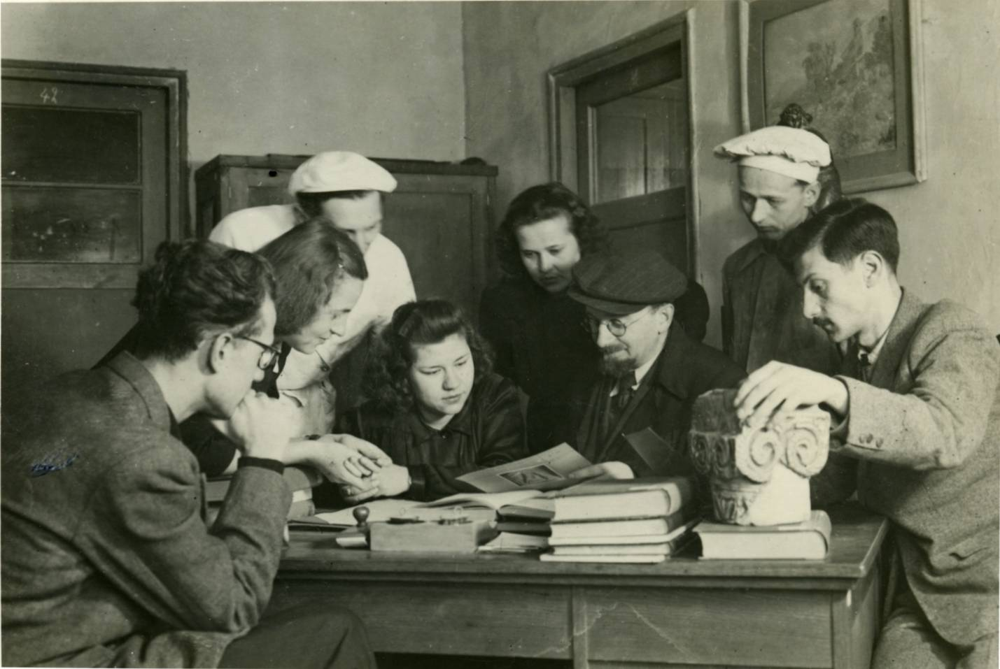

# { title }

## Povijest 

Gipsoteku je 1937. godine osnovao dr. Antun Bauer, povjesničar umjetnosti, arheolog, muzeolog, kolekcionar i kulturni vizionar s ciljem prezentiranja sadrenih odljeva spomenika hrvatske kulturne baštine, te djelima modernog i suvremenog hrvatskoga kiparstva. Strast za sabiranjem Bauer pokazuje još od studentskih dana, kada je započeo sakupljati sadrene odljeve i sadrene modele hrvatskih kipara koji u to vrijeme nisu bili cijenjeni. Na studijskim putovanjima upoznao je brojne europske zbirke odljeva i muzeje, što mu je bio poticaj da u Zagrebu osnuje sličan muzej. Svoju zbirku 25. listopada 1937. ustupa Gradu Zagrebu[^1] da je _nedjeljivo pohrani u doličnim prostorijama i time da položi temelj osnutaka Gipsoteke koja bi bila za nauku i za domaću umjetnost od vanredne koristi_.[^2] Kasnijim ulaskom u sastav Jugoslavenske akademije znanosti i umjetnosti 1950. godine Gipsoteka je preimenovana i od 1952. godine djeluje pod nazivom **Gliptoteka**.[^3]  Osnutkom ovog jedinstvenog muzeja Zagreb se upisuje na kartu brojnih muzeja i institucija koji su baštinili takvu vrstu građe &ndash; sadrene odljeve i skulpturu.

[^1]: Zaključkom sa sjednice Ekonomskog odbora Gradskog vijeća od 21. 10. 1937., prema prethodnom usmenom sporazumu Bauera s tadašnjim gradonačelnikom Teodorom Peičićem i gradskim senatorom Zvonimirom Maticom, darovnicu A. Bauer 25. 10. 1937. uručuje preko prof. dr. Petra Knolla gradonačelniku Peičiću. To je službeni datum osnutka muzeja.
[^2]: Bauer, Antun, _Gipsoteka 1937. – 1947._, tipkopis, Arhiv Gliptoteke HAZU, Zagreb, 1948., 14.
[^3]: Gliptoteka potječe od grčkog naziva: γλυπτοΘήκή (_glyptothíki_) muzej ili dvorana skulptura, γλυπτική (_glyptikí_) skulptura.